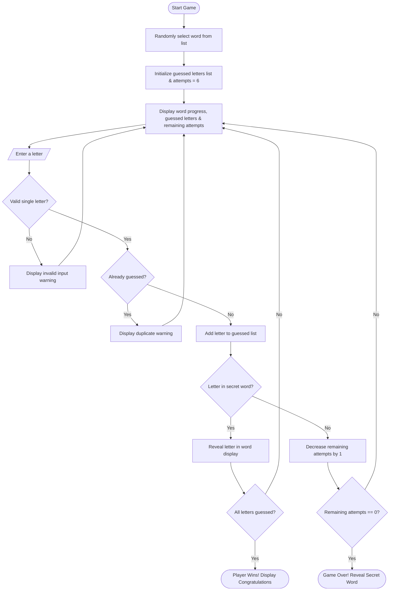

# Hangman Game

A simple, beginner-friendly text-based Hangman game built using Python. The player attempts to guess a randomly selected secret word one letter at a time within a limited number of attempts.

---

## Project Description

This project was developed as a Python internship task to demonstrate core programming fundamentals, structured problem-solving, and clean console application design. The game randomly selects a word from a predefined list and prompts the user to guess individual letters. The program dynamically reveals correctly guessed letters while tracking remaining attempts and previously guessed letters.

---

## Features

- **Random Word Selection**: Randomly picks one secret word each round from a predefined list.
- **Dynamic Word Display**: Shows hidden letters using underscores (`_`) that automatically update as correct guesses are made.
- **Strict Input Validation**: Rejects numbers, special characters, multi-character entries, and empty inputs with helpful error messages.
- **Duplicate Guess Prevention**: Tracks previously guessed letters so the player is not penalized for repeating a guess.
- **Attempt Tracking**: Allows up to 6 incorrect guesses and clearly displays the remaining count after each turn.
- **Clean Console Interface**: Formatted text output with clear dividers for an intuitive user experience.
- **Win & Loss Notifications**: Displays celebratory messages upon winning and reveals the correct word upon losing.

---

## Technologies Used

- **Language**: Python 3
- **Libraries**: Python Standard Library (`random`)
- **Dependencies**: None (Zero external packages required)

---

## Concepts Used

- **`random` module**: For choosing a random word from the list.
- **`while` loop**: For running the main game loop until a win or loss condition is met.
- **`if-elif-else` conditional statements**: For input validation, checking guesses, and determining game outcome.
- **Strings and String Methods**: For formatting output, case normalization (`.lower()`), and whitespace trimming (`.strip()`).
- **Lists and List Comprehensions**: For storing predefined words, tracking guessed letters, and building the word display representation.
- **Functions and Modular Design**: Clean separation of responsibilities (`choose_word`, `display_word`, `is_word_guessed`, `play_game`).

---

## Game Rules

1. The computer selects a secret word at random.
2. The player starts with **6 incorrect attempts**.
3. In each turn, the player guesses **one letter**.
4. If the letter is in the word:
   - All occurrences of that letter are revealed.
   - Remaining attempts do not decrease.
5. If the letter is not in the word:
   - The letter is marked as guessed.
   - Remaining attempts decrease by **1**.
6. If the player repeats an already guessed letter:
   - A warning message is shown.
   - No attempts are deducted.
7. **Winning**: The player wins when all letters of the word are uncovered before running out of attempts.
8. **Losing**: The player loses when 6 incorrect guesses are made. The correct word is then revealed.

---

## Predefined Words

The game selects from the following 5 beginner-friendly words:

1. `python`
2. `computer`
3. `programming`
4. `developer`
5. `algorithm`

---

## How the Game Works



---

## Project Structure

```text
hangman-game/
│
├── hangman.py         # Main Python source code with complete game logic
├── requirements.txt   # Project dependencies documentation (standard library only)
├── .gitignore         # Specifies intentionally untracked files to ignore
├── LICENSE            # MIT License
└── README.md          # Project documentation and guide
```

---

## How to Install and Run

### Prerequisites

- Python 3.6 or higher installed on your system.

### Steps to Run

1. Clone or download this repository to your local machine:
   ```bash
   git clone <repository-url>
   cd hangman-game
   ```

2. Run the game using Python:
   ```bash
   python hangman.py
   ```

---

## Example Gameplay

```text
===================================
           HANGMAN GAME            
===================================
Welcome to Hangman!
Guess the word one letter at a time.
You have 6 incorrect attempts allowed.
===================================

Word: _ _ _ _ _ _
Guessed letters: None
Remaining attempts: 6
-----------------------------------
Enter a letter: p

Good guess! 'p' is in the word.

Word: p _ _ _ _ _
Guessed letters: p
Remaining attempts: 6
-----------------------------------
Enter a letter: z

Incorrect guess! 'z' is not in the word.

Word: p _ _ _ _ _
Guessed letters: p, z
Remaining attempts: 5
-----------------------------------
Enter a letter: y

Good guess! 'y' is in the word.

Word: p y _ _ _ _
Guessed letters: p, z, y
Remaining attempts: 5
-----------------------------------
...
===================================
Word: p y t h o n
===================================
Congratulations! You won!
You correctly guessed the word: 'python'
===================================
```

---

## Learning Outcomes

- Learned how to structure a Python script using functions.
- Practiced string manipulation, list indexing, and loops.
- Implemented robust input validation and defensive programming techniques.
- Gained experience creating clean user interaction flows in the terminal.
- Practiced standard Git repository setup with documentation and license files.

---

## Future Improvements

- Add difficulty levels (easy, medium, hard) with varying word lengths and attempt counts.
- Add ASCII art illustrations for the hangman visual state.
- Add an option to replay the game after a round ends.
- Allow loading custom word categories from a plain text file.

---

## Author

**Palak Panchal**

---

## License

This project is licensed under the MIT License - see the [LICENSE](LICENSE) file for details.
